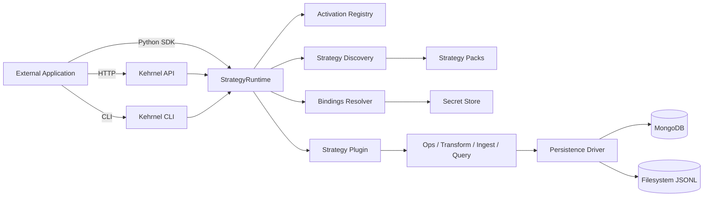

# kehrnel

This project is an experimental, non-production environment for demonstration purposes only.  It is not an official MongoDB product and is not formally supported by MongoDB.  MongoDB makes no representation or warranty as to the accuracy, adequacy, completeness, and fitness for a particular purpose in respect of any materials made available through the Healthcare Data Lab.”

kehrnel is a reference modeling layer, which can be used to structure healthcare modeling patterns, with:
- Strategy-pack API (`FastAPI`)
- Runtime/activation engine
- CLI tooling for mapping, validation, ingest, transform, and pack validation

## Active Scope

This repository is intentionally focused on:
- `src/kehrnel/api` (API surface)
- `src/kehrnel/engine` (core/common/domains/strategies)
- `src/kehrnel/cli` (CLI commands)
- `src/kehrnel/persistence` (persistence drivers + adapters)
- `docs/` (project documentation)
- `samples/` and `tests/`

## Quick Start

```bash
git clone <repo>
cd kehrnel
python3 --version  # 3.10+ required
python3 -m venv .venv
source .venv/bin/activate
pip install -e .[all]
# Build docs site (optional but recommended if you want /guide on port 8000)
cd docs/website && npm install && npm run build && cd ../..
uvicorn kehrnel.api.app:app --reload
```

API docs:
- `http://localhost:8000/docs`
- `http://localhost:8000/redoc`
- `http://localhost:8000/guide` (Docusaurus site, if built)

## Documentation Serving Model

Kehrnel serves all API/docs surfaces from the same API server port (default `8000`):

- Swagger UI: `/docs`
- ReDoc: `/redoc`
- Docusaurus site: `/guide` (served from `docs/website/build`)

Notes:
- If `docs/website/build` does not exist, `/guide` will show a “documentation is not built” message.
- During docs authoring you can also run the Docusaurus dev server separately on `8001`:

```bash
cd docs/website
npm start
```

In dev mode, API links are proxied to `KEHRNEL_API_ORIGIN` (default `http://localhost:8000`).

Full integration guide:
- `examples/README.md`
- Docusaurus source: `docs/website/docs/`

## Strategy Packs

Built-in strategy packs live under:
- `src/kehrnel/engine/strategies`

Additional packs can be discovered with:
- `KEHRNEL_STRATEGY_PATHS=/path/a:/path/b`

Validate a pack:

```bash
kehrnel common validate-pack /path/to/strategy-pack
```

## CLI

Primary CLI entrypoint:
- `kehrnel` (`auth`, `context`, `resource`, `op`, `run`, `core`, `common`, `domain`, `strategy`)
- `kehrnel-api` (API server launcher)

Complete CLI docs:
- `docs/website/docs/cli/overview.md`
API reference:
- Swagger: `/docs`
- ReDoc: `/redoc`

## Standalone Usage

Kehrnel can be used independently of Healthcare Data Lab as:
- a reference modeling layer, which can be used to structure healthcare modeling patterns,
- a CLI toolkit (scripts/CI),
- an HTTP API service (for external applications).

## Runtime Architecture



Current built-in persistence drivers:
- `mongodb` (alias: `mongo`)
- `filesystem` (aliases: `fs`, `file`)

The driver layer is open for extension through `register_driver(...)` in `src/kehrnel/persistence/__init__.py`.

Execution contract:
1. Discover strategy manifests.
2. Activate environment (`env_id + domain + strategy + config + bindings_ref`).
3. Dispatch capability (`compile_query`, `query`, `ingest`, `transform`, `op`, etc.).
4. Strategy plugin executes with resolved bindings and strategy config.

## API Integration Model

1. Discover strategies:
- `GET /strategies`
- `GET /strategies/{strategy_id}`

2. Activate an environment:
- `POST /environments/{env_id}/activate`

Activation binds:
- `strategy_id`
- `domain`
- strategy `config`
- secure `bindings_ref` (recommended)

3. Execute by environment:
- `POST /environments/{env_id}/compile_query`
- `POST /environments/{env_id}/query`
- `POST /environments/{env_id}/ingest`
- `POST /environments/{env_id}/transform`
- `POST /environments/{env_id}/apply`
- `GET /environments/{env_id}/capabilities`
- `POST /environments/{env_id}/run`
- `POST /environments/{env_id}/activations/{domain}/ops/{op}`

4. Strategy-specific APIs (example):
- `/api/strategies/openehr/rps_dual/*`

Clinical domain APIs:
- `/api/domains/openehr/*`

## Security Baseline

For public deployment, set these before exposure:
- `KEHRNEL_AUTH_ENABLED=true`
- `KEHRNEL_API_KEYS=<comma-separated-keys>`
- `KEHRNEL_CORS_ORIGINS=<explicit-origins>` (avoid `*` in production)
- `KEHRNEL_RATE_LIMIT=<requests/minute>`

For secure database binding resolution:
- `KEHRNEL_BINDINGS_RESOLVER=<module:function>`
- prefer `bindings_ref` over plaintext bindings

## Examples

- Python embedding: `examples/sdk/runtime_embed_example.py`
- HTTP flow: `examples/api/curl_flow.sh`
- CLI skeleton: `examples/cli/pipeline.sh`
- Full CLI workflow smoke: `examples/cli/full_workflow_console.sh`

## Tests

```bash
pytest tests/contract
```

Notes:
- Contract/golden tests target the active strategy runtime.

## Quality and Security Checks

Install developer tooling:

```bash
pip install -e .[dev]
pre-commit install
```

Run the local quality gate:

```bash
pre-commit run --all-files
ruff check --select F821 src tests
bandit -c pyproject.toml -lll -r src/kehrnel
pip-audit
```

## License

NOTICE: This repository is licensed under the Apache License, Version 2.0,
with the exception of specific files. The data strategies, templates, schemas,
and design artifacts in `src/kehrnel/engine/strategies/` are licensed under the
Creative Commons Attribution 4.0 International License (CC BY 4.0). You may
use, share, adapt, and build upon these materials, provided you give
appropriate attribution.

See the LICENSE file in that directory for details:
https://creativecommons.org/licenses/by/4.0/
