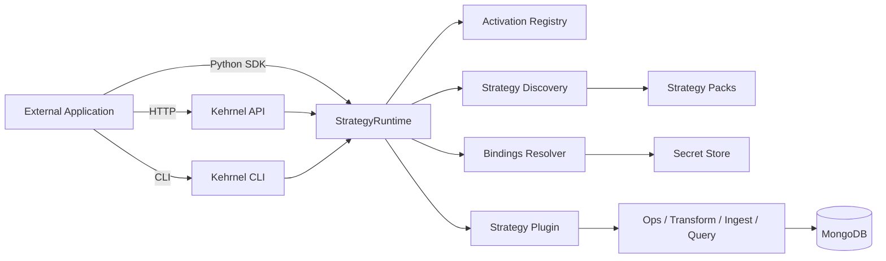

# kehrnel

`kehrnel` is a strategy runtime that turns healthcare data models into operational capabilities.

It exists because defining a healthcare data model is not enough. Teams also need a repeatable way to validate data, transform it into an operational representation, ingest it, query it, maintain it, and evolve it as requirements change. Without that execution layer, models often remain documentation, storage schemas, or isolated specifications.

It starts with openEHR on MongoDB because openEHR is a strong test case for semantic depth: archetypes, templates, terminology, paths, temporal context, and query semantics all need to survive the move from model to storage. The broader purpose is not to build an openEHR engine only. `kehrnel` defines a repeatable document-first way to operationalize data models through strategy packs, activate those strategies per environment, expose model-aware APIs, and provide safer execution surfaces for applications, education, and agentic AI workflows.

The useful boundary is the contract between a model, the strategy that operationalizes it, and the tools that call it. Healthcare Data Lab can act as the portal and control plane; `kehrnel` acts as the execution plane.

## What kehrnel Provides

- Strategy-pack API (`FastAPI`) for discovering, validating, and loading strategy definitions
- Runtime and activation engine for binding a strategy to an environment, domain, config, and secure data binding
- CLI tooling for mapping, validation, ingest, transform, query, and pack validation
- Runtime endpoints for query compilation, execution, strategy operations, synthetic jobs, and OpenAPI/guide access
- Exposed workflows that each persistence strategy can customize for activation, validation, ingestion, transformation, querying, synthetic data, and maintenance
- A foundation for semantic and agentic workflows where tools operate through explicit contracts instead of guessing against raw collections

## Why It Exists

Healthcare data models are often rich on paper and difficult to use operationally. `kehrnel` is the layer that asks:

- How does this model become a working API?
- How does a query language compile to a database-native plan?
- How do mappings, dictionaries, indexes, and operational jobs stay versioned and inspectable?
- How can AI agents use model semantics without improvising execution?

The current implementation answers those questions first for openEHR. The same architecture is intended to invite new strategy families for FHIR, ContextObjects, synthetic data generation, semantic catalogs, natural language retrieval, semantic products, and other healthcare-specific tooling.

## Active Scope

This repository is intentionally focused on:
- `src/kehrnel/api` (API surface)
  - includes `src/kehrnel/api/compatibility` compatibility modules still used by current domain routes
- `src/kehrnel/engine` (core/common/domains/strategies)
- `src/kehrnel/cli` (CLI commands)
- `samples/` and `tests/`

Removed from active scope:
- old standalone frontend
- old non-package API tree (`src/api`)
- old app entrypoint tree (`src/app`)

## Quick Start

```bash
git clone <repo>
cd kehrnel
./startKehrnel
```

API docs:
- `http://localhost:8080/docs`
- `http://localhost:8080/redoc`
- `http://localhost:8080/guide`

`./startKehrnel` bootstraps `uv` if needed, installs Python 3.12 locally, creates `.venv`, syncs `.[all]`, builds the docs site if `docs/website/build` is missing, and starts the API with dev-friendly defaults:
- `KEHRNEL_AUTH_ENABLED=false`
- `KEHRNEL_INIT_INGESTION_RUNTIME=false`

Local port note:
- `./startKehrnel` serves the runtime on `http://localhost:8080`
- `kehrnel-api` or `uvicorn kehrnel.api.app:app` use `KEHRNEL_API_PORT` and default to `8000`

Useful flags:

```bash
./startKehrnel --build-docs
./startKehrnel --port 8080
./startKehrnel --no-reload
```

## Documentation Serving Model

Kehrnel serves all API/docs surfaces from the same API server port (default `8000`):

- Swagger UI: `/docs`
- ReDoc: `/redoc`
- Docusaurus site: `/guide` (served from `docs/website/build`)

Notes:
- If `docs/website/build` does not exist, `/guide` will show a “documentation is not built” message.
- During docs authoring you can also run the Docusaurus dev server separately on `8001`:

```bash
cd docs/website
npm start
```

In Docusaurus dev mode, API links are proxied to `KEHRNEL_API_ORIGIN` (default `http://localhost:8080` to match `./startKehrnel`).

Full integration guide:
- `examples/README.md`

## Runtime Endpoints Used by HDL

- `GET /strategies`
- `GET /strategies/{id}`
- `GET /environments`
- `POST /environments`
- `GET /environments/{env}`
- `PATCH /environments/{env}`
- `DELETE /environments/{env}`
- `POST /environments/{env}/activate`
- `GET /environments/{env}/capabilities`
- `POST /environments/{env}/run`
- `POST /environments/{env}/compile_query`
- `POST /environments/{env}/query`
- `POST /environments/{env}/activations/{domain}/ops/{op}`

Preferred runtime pattern:
- use `POST /environments/{env}/run` for universal workflows
- use `POST /environments/{env}/activations/{domain}/ops/{op}` for direct strategy op execution
- keep `POST /environments/{env}/compile_query` and `POST /environments/{env}/query` for explicit runtime query surfaces

Detailed contract docs:
- this README (standalone and integration model)

## Strategy Packs

Built-in strategy packs live under:
- `src/kehrnel/engine/strategies`

Additional packs can be discovered with:
- `KEHRNEL_STRATEGY_PATHS=/path/a:/path/b`

Validate a pack:

```bash
kehrnel common validate-pack /path/to/strategy-pack
```

## CLI

Primary CLI entrypoint:
- `kehrnel` (`auth`, `context`, `resource`, `op`, `run`, `core`, `common`, `domain`, `strategy`)
- `kehrnel-api` (API server launcher)

## Standalone Usage

Kehrnel can be used independently of Healthcare Data Lab as:
- a Python runtime library (embed in your backend),
- a CLI toolkit (scripts/CI),
- an HTTP API service (for external applications).

## Runtime Architecture



Execution contract:
1. Discover strategy manifests.
2. Activate environment (`env_id + domain + strategy + config + bindings_ref`).
3. Dispatch capability (`compile_query`, `query`, `ingest`, `transform`, `op`, etc.).
   Preferred universal dispatch is `POST /environments/{env_id}/run`.
4. Strategy plugin executes with resolved bindings and strategy config.

## API Integration Model

1. Discover strategies:
- `GET /strategies`
- `GET /strategies/{strategy_id}`

2. Activate an environment:
- `POST /environments/{env_id}/activate`

Activation binds:
- `strategy_id`
- `domain`
- strategy `config`
- secure `bindings_ref` (recommended)

3. Execute by environment:
- `POST /environments/{env_id}/compile_query`
- `POST /environments/{env_id}/query`
- `POST /environments/{env_id}/ingest`
- `POST /environments/{env_id}/transform`
- `POST /environments/{env_id}/apply`
- `GET /environments/{env_id}/capabilities`
- `POST /environments/{env_id}/run`
- `POST /environments/{env_id}/activations/{domain}/ops/{op}`

4. Strategy-specific APIs (example):
- `/api/strategies/openehr/rps_dual/*`

Clinical domain APIs:
- `/api/domains/openehr/*`

## Security Baseline

For public deployment, set these before exposure:
- `KEHRNEL_AUTH_ENABLED=true`
- `KEHRNEL_API_KEYS=<comma-separated-keys>`
- `KEHRNEL_CORS_ORIGINS=<explicit-origins>` (avoid `*` in production)
- `KEHRNEL_RATE_LIMIT=<requests/minute>`

For secure database binding resolution:
- `KEHRNEL_BINDINGS_RESOLVER=<module:function>`
- prefer `bindings_ref` over plaintext bindings

## Examples

- Python embedding: `examples/sdk/runtime_embed_example.py`
- HTTP flow: `examples/api/curl_flow.sh`
- CLI skeleton: `examples/cli/pipeline.sh`
- Full CLI workflow smoke: `examples/cli/full_workflow_console.sh`

## Tests

```bash
pytest tests/contract
```

Notes:
- Contract/golden tests target the active strategy runtime.
- The public API exposes both the canonical `openehr.rps_dual` strategy and the production `openehr.rps_dual_ibm` variant where installed deployments depend on IBM-compatible behavior.

## License

Code is Apache 2.0 (`LICENSE`).

Strategy data assets under `src/kehrnel/engine/strategies/` are CC BY 4.0 (see `src/kehrnel/engine/strategies/LICENSE`).
