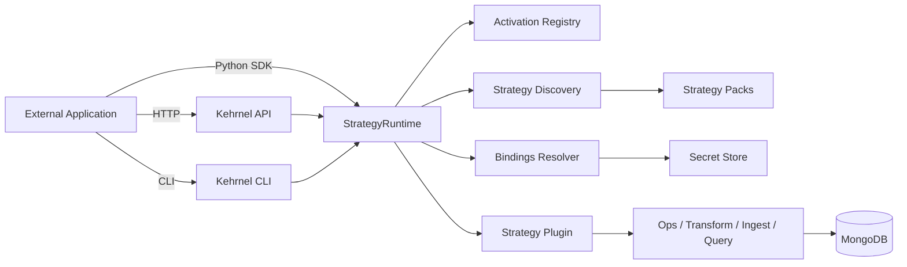

# kehrnel

`kehrnel` is a Python runtime for strategy packs, with:
- Strategy-pack API (`FastAPI`)
- Runtime/activation engine
- CLI tooling for mapping, validation, ingest, transform, and pack validation

## Active Scope

This repository is intentionally focused on:
- `src/kehrnel/api` (API surface)
  - includes `src/kehrnel/api/compatibility` compatibility modules still used by current domain routes
  - domain HTTP: `src/kehrnel/api/domains/{fhir,openehr}/`
- `src/kehrnel/engine` (runtime, strategy packs under `engine/strategies/`)
- `src/kehrnel/engine/domains` (domain logic and assets; FHIR **fhir-gen** / **fhir-mql** under `engine/domains/fhir/libs/`)
- `src/kehrnel/cli` (CLI commands)
- `samples/` and `tests/`

Removed from active scope:
- old standalone frontend
- old non-package API tree (`src/api`)
- old app entrypoint tree (`src/app`)

## Quick Start

Recommended one-command startup from a fresh clone:

```bash
git clone <repo>
cd kehrnel
./startKehrnel
```

`./startKehrnel` bootstraps `uv` if needed, installs Python 3.12 locally, creates `.venv`, syncs `.[all]`, builds the docs site if `docs/website/build` is missing, and starts the API with dev-friendly defaults:
- `KEHRNEL_AUTH_ENABLED=false`
- `KEHRNEL_INIT_INGESTION_RUNTIME=false`

Manual setup, useful when you want to control the virtual environment yourself:

```bash
git clone <repo>
cd kehrnel
python3 -m venv .venv
source .venv/bin/activate
python -m pip install --upgrade pip
python -m pip install -r requirements.txt
./startKehrnel --skip-sync
```

On Windows PowerShell, activate the environment with:

```powershell
.\.venv\Scripts\Activate.ps1
```

Avoid `pip install --user ...` while a virtual environment is active. Python hides user site-packages inside many virtualenvs, which produces:

```text
ERROR: Can not perform a '--user' install. User site-packages are not visible in this virtualenv.
```

Troubleshooting stale checkouts:

```bash
git fetch origin
git checkout fix/normalize-bson-uuid-results
git pull --ff-only origin fix/normalize-bson-uuid-results
./startKehrnel
```

On startup the script prints its branch and commit, for example:

```text
[startKehrnel] Using startKehrnel 2026-07-01.2 from fix/normalize-bson-uuid-results@<commit>
```

If the log says `Installing uv via python3 -m pip`, you are running an old copy of `startKehrnel`; pull the branch again.

API docs:
- `http://localhost:8080/docs`
- `http://localhost:8080/redoc`
- `http://localhost:8080/guide`

Local port note:
- `./startKehrnel` serves the runtime on `http://localhost:8080`
- `kehrnel-api` or `uvicorn kehrnel.api.app:app` use `KEHRNEL_API_PORT` and default to `8000`

Useful flags:

```bash
./startKehrnel --build-docs
./startKehrnel --port 8080
./startKehrnel --no-reload
```

## Documentation Serving Model

Kehrnel serves all API/docs surfaces from the same API server port (default `8000`):

- Swagger UI: `/docs`
- ReDoc: `/redoc`
- Docusaurus site: `/guide` (served from `docs/website/build`)

Notes:
- If `docs/website/build` does not exist, `/guide` will show a “documentation is not built” message.
- During docs authoring you can also run the Docusaurus dev server separately on `8001`:

```bash
cd docs/website
npm start
```

In Docusaurus dev mode, API links are proxied to `KEHRNEL_API_ORIGIN` (default `http://localhost:8080` to match `./startKehrnel`).

Full integration guide:
- `examples/README.md`
- `docs/cli-api-reference.md`

### FHIR domain (optional)

FHIR is optional: core Kehrnel and openEHR work without it. When enabled, use strategy **`fhir.clinical_cdr`**.

| Layer | Location |
|-------|----------|
| HTTP search API | `src/kehrnel/api/domains/fhir/` |
| Strategy pack | `src/kehrnel/engine/strategies/fhir/clinical_cdr/` |
| **fhir-gen** + **fhir-mql** (vendored) | `src/kehrnel/engine/domains/fhir/libs/` |

Install (from repo root):

```bash
pip install -e src/kehrnel/engine/domains/fhir/libs/fhir-data-generation -e src/kehrnel/engine/domains/fhir/libs/fhir-search-to-mql
pip install -e ".[api,mongo,fhir]"
# ./startKehrnel installs vendored libraries + .[all] via uv automatically
```

- Library details: [src/kehrnel/engine/domains/fhir/libs/README.md](src/kehrnel/engine/domains/fhir/libs/README.md)
- **Full test playbook:** [FHIR_TESTING.md](FHIR_TESTING.md)
- Strategy pack: [clinical_cdr/README.md](src/kehrnel/engine/strategies/fhir/clinical_cdr/README.md)
- Smoke: `python src/kehrnel/engine/strategies/fhir/clinical_cdr/scripts/spike_generate_and_search.py --db fhir_kehrnel_spike`

Docker: `docker compose --profile fhir up kehrnel-fhir-api` or `Dockerfile.backend` (all-in-one with FHIR).

## Runtime Endpoints Used by HDL

- `GET /strategies`
- `GET /strategies/{id}`
- `GET /environments`
- `POST /environments`
- `GET /environments/{env}`
- `PATCH /environments/{env}`
- `DELETE /environments/{env}`
- `POST /environments/{env}/activate`
- `GET /environments/{env}/capabilities`
- `POST /environments/{env}/run`
- `POST /environments/{env}/compile_query`
- `POST /environments/{env}/query`
- `POST /environments/{env}/activations/{domain}/ops/{op}`

Preferred runtime pattern:
- use `POST /environments/{env}/run` for universal workflows
- use `POST /environments/{env}/activations/{domain}/ops/{op}` for direct strategy op execution
- keep `POST /environments/{env}/compile_query` and `POST /environments/{env}/query` for explicit runtime query surfaces

Detailed contract docs:
- this README (standalone and integration model)

## Strategy Packs

Built-in strategy packs live under:
- `src/kehrnel/engine/strategies`

Additional packs can be discovered with:
- `KEHRNEL_STRATEGY_PATHS=/path/a:/path/b`

Validate a pack:

```bash
kehrnel common validate-pack /path/to/strategy-pack
```

## CLI

Primary CLI entrypoint:
- `kehrnel` (`auth`, `context`, `resource`, `op`, `run`, `core`, `common`, `domain`, `strategy`)
- `kehrnel-api` (API server launcher)

Complete CLI + endpoint inventory:
- `docs/cli-api-reference.md`

## Standalone Usage

Kehrnel can be used independently of Healthcare Data Lab as:
- a Python runtime library (embed in your backend),
- a CLI toolkit (scripts/CI),
- an HTTP API service (for external applications).

## Runtime Architecture


```mermaid
flowchart LR
  APP[External Application] -->|HTTP| API[Kehrnel API]
  APP -->|Python SDK| RT[StrategyRuntime]
  APP -->|CLI| CLI[Kehrnel CLI]

  API --> RT
  CLI --> RT

  RT --> REG[Activation Registry]
  RT --> DISC[Strategy Discovery]
  DISC --> PACKS[Strategy Packs]
  RT --> RES[Bindings Resolver]
  RES --> SECRETS[Secret Store]

  RT --> PLUG[Strategy Plugin]
  PLUG --> OPS[Ops / Transform / Ingest / Query]
  OPS --> MONGO[(MongoDB)]
```

Execution contract:
1. Discover strategy manifests.
2. Activate environment (`env_id + domain + strategy + config + bindings_ref`).
3. Dispatch capability (`compile_query`, `query`, `ingest`, `transform`, `op`, etc.).
   Preferred universal dispatch is `POST /environments/{env_id}/run`.
4. Strategy plugin executes with resolved bindings and strategy config.

## API Integration Model

1. Discover strategies:
- `GET /strategies`
- `GET /strategies/{strategy_id}`

2. Activate an environment:
- `POST /environments/{env_id}/activate`

Activation binds:
- `strategy_id`
- `domain`
- strategy `config`
- secure `bindings_ref` (recommended)

3. Execute by environment:
- `POST /environments/{env_id}/compile_query`
- `POST /environments/{env_id}/query`
- `POST /environments/{env_id}/ingest`
- `POST /environments/{env_id}/transform`
- `POST /environments/{env_id}/apply`
- `GET /environments/{env_id}/capabilities`
- `POST /environments/{env_id}/run`
- `POST /environments/{env_id}/activations/{domain}/ops/{op}`

4. Strategy-specific APIs (example):
- `/api/strategies/openehr/rps_dual/*`

Domain APIs:
- `/api/domains/openehr/*`
- `/api/domains/fhir/*` (requires `[fhir]` install and `fhir.clinical_cdr` activation)

## Security Baseline

For public deployment, set these before exposure:
- `KEHRNEL_AUTH_ENABLED=true`
- `KEHRNEL_API_KEYS=<comma-separated-keys>`
- `KEHRNEL_CORS_ORIGINS=<explicit-origins>` (avoid `*` in production)
- `KEHRNEL_RATE_LIMIT=<requests/minute>`

For secure database binding resolution:
- `KEHRNEL_BINDINGS_RESOLVER=<module:function>`
- prefer `bindings_ref` over plaintext bindings

## Examples

- Python embedding: `examples/sdk/runtime_embed_example.py`
- HTTP flow: `examples/api/curl_flow.sh`
- CLI skeleton: `examples/cli/pipeline.sh`
- Full CLI workflow smoke: `examples/cli/full_workflow_console.sh`

## Tests

```bash
pytest tests/contract
```

Notes:
- Contract/golden tests target the active strategy runtime.
- Some tests still exercise compatibility routes while API/domain migration is completed.

## License

Code is Apache 2.0 (`LICENSE`).

Strategy data assets under `src/kehrnel/engine/strategies/` are CC BY 4.0 (see `src/kehrnel/engine/strategies/LICENSE`).
