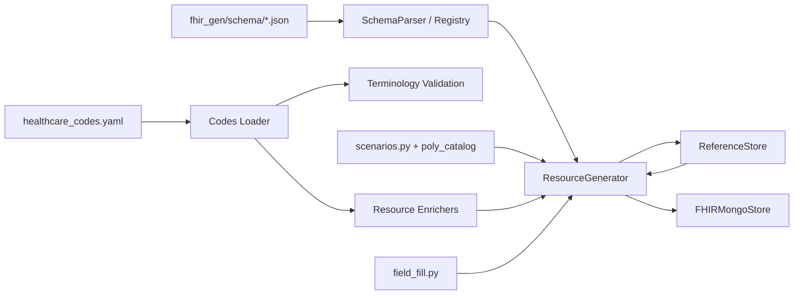

# fhir-gen

**FHIR R5 synthetic healthcare data generator** — schema-driven, interlinked, terminology-aware synthetic FHIR resources with optional MongoDB persistence and a full CLI.

- **158** FHIR R5 resource types from the packaged JSON schema (`fhir_gen/schema/fhir.schema.v5.json`)
- **54** optional clinical enrichers for realistic fields (Patient, Observation, Claim, etc.)
- **HL7 terminology** from `fhir_gen/hl7_codes/healthcare_codes.yaml` (98 sections) with validation of `Coding.system` / `Coding.code`
- **Lifecycle & polymorphic scenarios** — named Patient/Practitioner/Person variants plus schema `poly_`* choice coverage (~49 resource types)
- Seeded generation, dependency ordering, schema-aware field fill, reference integrity
- MongoDB collections per resource type (`Patient`, `Observation`, … or `{prefix}{ResourceType}` when configured)

**Requirements:** Python **3.11+**, MongoDB **optional** (for `--save`, `search`, `db-stats`)

---

## Installation

### From source (development)

```bash
python -m venv .venv
# Windows: .\.venv\Scripts\Activate.ps1
# Windows bash: source .venv/Scripts/activate
# Linux/macOS: source .venv/bin/activate

pip install --upgrade pip
pip install -e ".[dev]"
```

### Dependencies only

```bash
pip install -r requirements.txt
```

### Published package (when published)

```bash
pip install fhir-gen
```

Copy environment defaults:

```bash
cp .env.example .env   # Unix
Copy-Item .env.example .env   # Windows PowerShell
```

---

## Quick start (Python API)

```python
from fhir_gen import ResourceGenerator
from fhir_gen.persistence import FHIRMongoStore

# Generate with automatic dependencies (Patient, etc.)
gen = ResourceGenerator(seed=42)
patients = gen.generate("Patient", count=5)
encounters = gen.generate("Encounter", count=10)

# Multi-type bundle in dependency order
bundle = gen.generate_many(
    ["Patient", "Practitioner", "Organization", "Encounter", "Observation"],
    counts={"Patient": 10, "Encounter": 20, "Observation": 50},
)

# Polymorphic variants (one Observation per value[x] choice)
variants = gen.generate_variants("Observation", variant_fields=["value"])

# Named lifecycle scenario (e.g. deceased patient with deceasedDateTime)
deceased = gen.generate_scenario("Patient", "deceased_datetime")

# All Patient named scenarios (9 records)
cohort = gen.generate_scenarios("Patient", named_only=True)

# Persist to MongoDB
store = FHIRMongoStore()
store.save_many(patients + encounters)
print(store.search_patient(family="Smith"))
store.close()
```

Custom schema (INSTRUCTIONS #6):

```python
from pathlib import Path

gen.generate("Patient", count=1, schema_version="R6")
```

---

## CLI

**Full command cookbook:** [CLI_COMMANDS.md](CLI_COMMANDS.md) — healthcare scenarios, `generate-many` bundles, PowerShell examples, and MongoDB search.

Global options: `--seed`, `--schema-version`, `--mongo-uri`, `--db`


| Command                             | Description                                                            |
| ----------------------------------- | ---------------------------------------------------------------------- |
| `fhir-gen version`                  | Package version                                                        |
| `fhir-gen list-resources`           | All 158 resource type names                                            |
| `fhir-gen list-scenarios [Type]`    | Named lifecycle + `poly_`* scenario catalog                            |
| `fhir-gen list-poly-groups [Type]`  | Schema choice groups (`value[x]`, `onset[x]`, …)                       |
| `fhir-gen generate <Type>`          | Generate one resource type (`--scenario`, `--scenarios`, `--variants`) |
| `fhir-gen generate-many <Types...>` | Multiple types in dependency order                                     |
| `fhir-gen schema-info <Type>`       | Schema fields and polymorphic groups                                   |
| `fhir-gen db-stats`                 | Document counts per collection                                         |
| `fhir-gen search <Type>`            | Query MongoDB                                                          |
| `fhir-gen clear [Type]`             | Drop collection(s)                                                     |


### Examples

```bash
# List types
fhir-gen list-resources

# Generate to stdout (no MongoDB)
fhir-gen --seed 42 generate Patient --count 3 --no-save

# Save to MongoDB (includes dependency resources in session store)
fhir-gen generate Encounter --count 5 --save

# Write JSON file
fhir-gen generate Observation --count 10 --no-save --output observations.json

# Polymorphic variants (all value[x] branches for Observation)
fhir-gen generate Observation --variants --no-save

# Named lifecycle scenario (deceasedDateTime, not deceasedBoolean)
fhir-gen generate Patient --scenario deceased_datetime --no-save

# All Patient named scenarios (9 records)
fhir-gen generate Patient --scenarios --no-save

# Skip auto-dependencies (schema-only single type)
fhir-gen generate Patient --count 1 --no-deps --no-save

# Clinical bundle (bash)
fhir-gen generate-many Patient Practitioner Organization Encounter Observation --counts '{"Patient":10,"Encounter":20,"Observation":50}' --save

# PowerShell: use one line, backtick continuation, or --count (recommended)
fhir-gen generate-many Patient Practitioner Organization Encounter Observation `
  --count Patient=10 --count Encounter=20 --count Observation=50 --save

# Schema inspection
fhir-gen schema-info MedicationRequest

# MongoDB
fhir-gen generate Patient --count 100 --save
fhir-gen db-stats
fhir-gen search Patient --limit 5
fhir-gen search Observation --patient-id <uuid> --code 8867-4
fhir-gen clear --yes
```

---

## MongoDB setup

1. Start MongoDB (default: `mongodb://localhost:27017`).
2. Configure `.env` (see [Environment variables](#environment-variables)).
3. Generate with `--save` (default). The CLI saves all resources accumulated in the generator session store (including dependencies).

Collections use the FHIR resource type name by default (`Patient`, `Observation`, …). Set `FHIR_GEN_MONGODB_COLLECTION_PREFIX` (e.g. `fhir_`) to get `fhir_Patient`, `fhir_Observation`, etc. Indexes are created on common search paths (`id`, `subject.reference`, `identifier.value`, etc.).

```bash
fhir-gen generate Patient --count 50 --save
fhir-gen generate Observation --count 200 --save
fhir-gen db-stats
```

---

## Supported resources

All **158** resources defined in `fhir_gen/schema/fhir.schema.v5.json` can be generated via the schema engine. Run:

```bash
fhir-gen list-resources
```

### Enriched resources (clinical + administrative)

These **54** types get optional enrichers with terminology from `fhir_gen/hl7_codes/healthcare_codes.yaml` (see `fhir_gen/generators/resources/`):


| Module          | Count | Resource types (examples)                                                                                                                                                                                                  |
| --------------- | ----- | -------------------------------------------------------------------------------------------------------------------------------------------------------------------------------------------------------------------------- |
| **Clinical**    | 15    | Patient, Practitioner, PractitionerRole, Organization, Location, Encounter, Observation, Condition, Procedure, AllergyIntolerance, DiagnosticReport, Immunization, FamilyMemberHistory, ClinicalImpression, RiskAssessment |
| **Medication**  | 6     | Medication, MedicationRequest, MedicationAdministration, MedicationDispense, MedicationStatement, MedicationKnowledge                                                                                                      |
| **Workflow**    | 13    | Appointment, CarePlan, CareTeam, Goal, ServiceRequest, Task, Communication, DocumentReference, Schedule, Slot, Flag, Consent, NutritionOrder                                                                               |
| **Financial**   | 7     | Coverage, Claim, ClaimResponse, Account, Invoice, ChargeItem, CoverageEligibilityRequest                                                                                                                                   |
| **Specialized** | 13    | Specimen, ImagingStudy, Device, ResearchStudy, ResearchSubject, QuestionnaireResponse, AuditEvent, EpisodeOfCare, HealthcareService, RelatedPerson, Group, DetectedIssue, Substance                                        |


All other resource types are still generated using the schema registry alone.

### Terminology & CodeSystems

- Canonical **R5 default schema** ships at `fhir_gen/schema/fhir.schema.v5.json` (optional R6: `fhir_gen/schema/fhir.schema.v6.json`).
- Codes load from `fhir_gen/hl7_codes/healthcare_codes.yaml` via `fhir_gen.codes.loader`.
- `fhir_gen.codes.validation` checks absolute `Coding.system` URIs, rejects ValueSet URLs, and validates codes against the YAML catalog (with pattern checks for SNOMED, LOINC, RxNorm).
- **Condition verification status** uses the HL7 canonical CodeSystem  
`http://terminology.hl7.org/CodeSystem/condition-ver-status` (not a ValueSet URL and not a relative `CodeSystem/...` path).
- Enrichers bind status/category fields to YAML sections (e.g. `condition_clinical_status`, `condition_verification_status`, `observation_categories`, `service_type`).
- Regenerate YAML after editing `_build_healthcare_codes.py`:  
`python fhir_gen/hl7_codes/_build_healthcare_codes.py`

---

## Architecture




1. **Schema** — `FHIRSchemaParser` reads JSON Schema definitions; `SchemaRegistry` caches `ResourceDef` (fields, required, polymorphic groups).
2. **Generators** — Primitives → complex types → special types (Meta, Reference, Dosage). Bare `CodeableConcept` calls without `system`/`code` emit text-only (no random SNOMED).
3. **Engine** — `ResourceGenerator` fills fields, resolves references via `ReferenceStore`, applies scenarios and one variant per `value[x]` group when requested.
4. **Field fill** — `fill_schema_gaps` / backbone fillers add contact, telecom, address, identifiers after enrichers.
5. **Dependencies** — `resolve_order()` topological sort from `CORE_DEPENDENCIES` + schema references.
6. **Enrichers** — Per-resource functions in `fhir_gen/generators/resources/` override fields with YAML-backed terminology.
7. **Scenarios** — Named lifecycle (`scenarios.py`) and schema polymorphic catalog (`poly_catalog.py`); CLI `--scenario` / `--scenarios` / `--variants`.
8. **Persistence** — `FHIRMongoStore` upserts to per-type collections with search indexes.

---

## Environment variables

Loaded from `.env` with prefix `FHIR_GEN_` (see `fhir_gen/config.py`).


| Variable                             | Default                                    | Description                                                      |
| ------------------------------------ | ------------------------------------------ | ---------------------------------------------------------------- |
| `FHIR_GEN_MONGODB_URI`               | `mongodb://localhost:27017`                | MongoDB connection string                                        |
| `FHIR_GEN_MONGODB_DB`                | `fhir_synthetic`                           | Database name                                                    |
| `FHIR_GEN_MONGODB_COLLECTION_PREFIX` | *(empty)*                                  | Prefix for collection names; empty → `Patient`, `Observation`, … |
| `FHIR_GEN_SEED`                      | *(none)*                                   | Default random seed (CLI `--seed` overrides)                     |
| `FHIR_GEN_SCHEMA_VERSION`            | `R5`                                         | FHIR release: `R5` (default) or `R6` (CLI `--schema-version`)    |
| `FHIR_GEN_SCHEMA_PATH`               | *(unset)*                                    | Optional advanced override of bundled schema JSON file           |
| `FHIR_GEN_CODES_PATH`                | `fhir_gen/hl7_codes/healthcare_codes.yaml` | Terminology YAML (override for custom code sets)                 |
| `FHIR_GEN_LOG_LEVEL`                 | `INFO`                                     | Logging level                                                    |


CLI flags `--mongo-uri`, `--db`, and `--schema-version` override settings for that invocation.

---

## Repository layout


| Path                                            | Purpose                                                         |
| ----------------------------------------------- | --------------------------------------------------------------- |
| `fhir_gen/`                                     | Python package (generators, schema parser, CLI, persistence)    |
| `fhir_gen/schema/fhir.schema.v5.json`           | Default FHIR R5 schema (packaged in wheel)                      |
| `fhir_gen/schema/fhir.schema.v6.json`           | Optional FHIR R6 preview schema                                 |
| `fhir_gen/codes/`                               | Terminology loader, validation, `codeable_from_section` helpers |
| `fhir_gen/hl7_codes/healthcare_codes.yaml`      | HL7/FHIR terminology (98 sections)                              |
| `fhir_gen/hl7_codes/_build_healthcare_codes.py` | Regenerate/merge YAML                                           |
| `tests/`                                        | Pytest suite (~1,800 tests)                                     |
| `CLI_COMMANDS.md`                               | Full CLI cookbook (scenarios, bundles, MongoDB)                 |
| `PROMPTS_FHIR_DATA_GENERATION.md`               | Implementation prompts                                          |
| `INSTRUCTIONS.txt`                              | Product requirements                                            |


---

## Development

```bash
# Activate venv, then:
pip install -e ".[dev]"
pytest tests/
ruff check fhir_gen tests
```

Focused test suites:

```bash
pytest tests/test_terminology_validation.py -v --no-cov   # CodeSystem / coding validation
pytest tests/test_scenarios.py -v --no-cov                # Named + poly scenarios
pytest tests/test_schema_reference_integrity.py -v --no-cov
pytest tests/test_schema_field_validation.py -v --no-cov
```

Regenerate terminology:

```bash
python fhir_gen/hl7_codes/_build_healthcare_codes.py
```

---

## Contributing

1. Use a virtual environment and `pip install -e ".[dev]"`.
2. Follow existing patterns in `fhir_gen/` (minimal scope, schema-first).
3. Add tests for new behavior; keep `pytest` coverage ≥ 75%.
4. Enrich `healthcare_codes.yaml` via `_build_healthcare_codes.py` rather than full rewrites.
5. New resource enrichers: add to the appropriate `fhir_gen/generators/resources/*.py` and register in `ENRICHERS`.

Implementation is guided by `PROMPTS_FHIR_DATA_GENERATION.md` and the Cursor skill `.cursor/skills/fhir-data-generation/SKILL.md`.

---

## Troubleshooting


| Issue                              | Fix                                                                                                         |
| ---------------------------------- | ----------------------------------------------------------------------------------------------------------- |
| `fhir-gen` not found               | Activate `.venv`; `pip install -e ".[dev]"`                                                                 |
| `ModuleNotFoundError: fhir_gen`    | Install from repo root with venv active                                                                     |
| MongoDB connection failed          | Check `FHIR_GEN_MONGODB_URI`; start `mongod`                                                                |
| PowerShell venv activation blocked | `Set-ExecutionPolicy RemoteSigned -Scope CurrentUser`                                                       |
| No `deceasedDateTime` on Patient   | Use `--scenario deceased_datetime` or `--scenarios`, not `generate Patient -n 1` alone                      |
| Wrong `Coding.system` on Condition | Enriched Condition uses `http://terminology.hl7.org/CodeSystem/condition-ver-status`; run terminology tests |
| Custom schema not found            | Use `fhir_gen/schema/fhir.schema.v6.json` or set `FHIR_GEN_SCHEMA_PATH`                                     |


---

## License

MIT (see `pyproject.toml`).